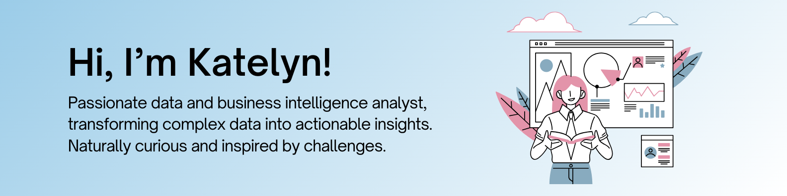

I'm a data enthusiast who loves making sense of the complex puzzle hidden in data.

  

A little about me:
- **Education:** B.S. in Economics and Marketing
- **Currently Learning:** Machine Learning, Azure, AWS
- All of my projects are available on [my website](https://www.katelynweese.com).

### 📬 Get in Touch
If you're interested in my work or have a project in mind, feel free to reach out. Let's connect!

Connect with me on [LinkedIn](https://www.linkedin.com/in/katelynweese).

<!---
katelynweese/katelynweese is a ✨ special ✨ repository because its `README.md` (this file) appears on your GitHub profile.
You can click the Preview link to take a look at your changes.
--->

<!---
katelynweese/katelynweese is a ✨ special ✨ repository because its `README.md` (this file) appears on your GitHub profile.
You can click the Preview link to take a look at your changes.
--->
